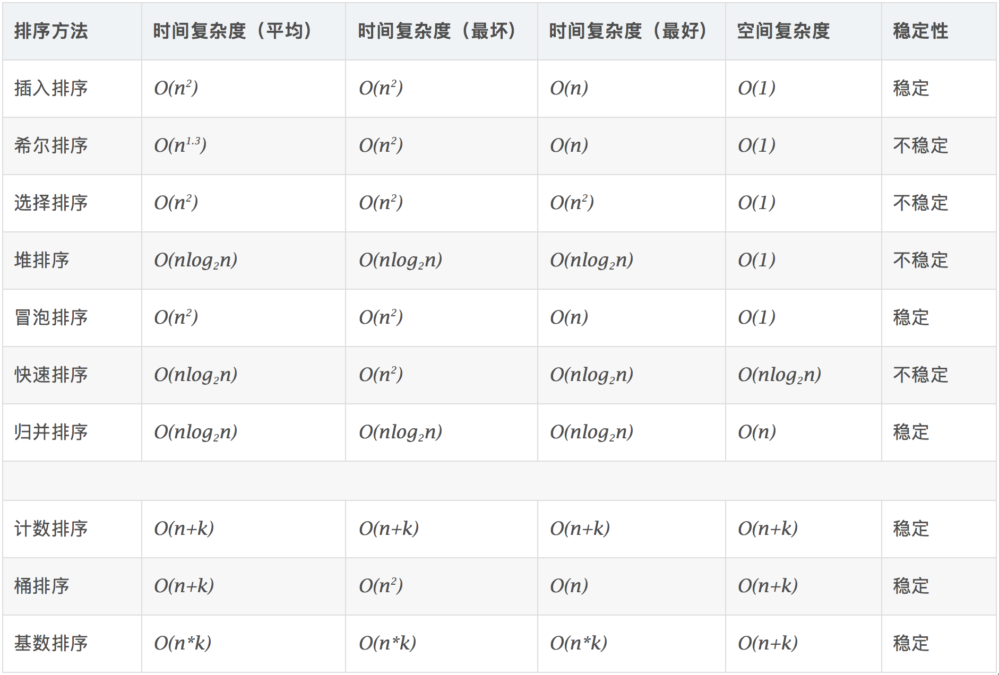

## 排序


## 树

## 图

## 杂项
### 牛顿迭代法求平方根
```python
#!/usr/bin/python3
# -*- coding:utf-8 -*-

import sys

def do_main():
	if len(sys.argv) < 2:
		return

		x = float( sys.argv[1] )
		y = x
		cnt = 0

		while True:
			if cnt > 500000 or abs( y*y-x ) < 1e-30:
				break
			else:
				y = ( y+x/y ) / 2
				cnt += 1

		print( "Result: {}, caculate times: {}".format(y,cnt) )

if __name__ == '__main__':
		do_main()
```
